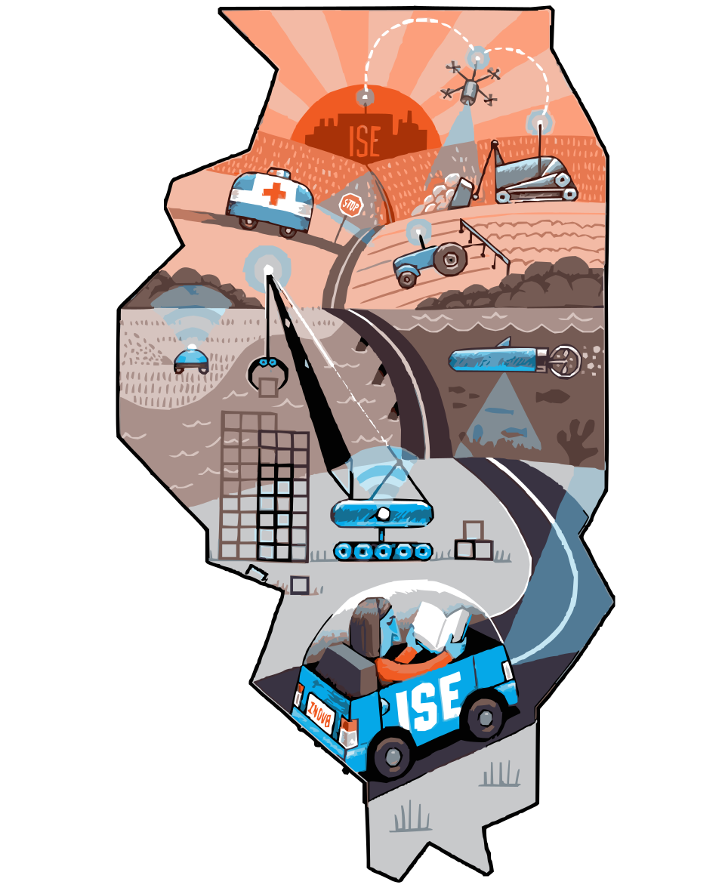

## Hi there 👋

<!--

**Here are some ideas to get you started:**

🙋‍♀️ A short introduction - what is your organization all about?
🌈 Contribution guidelines - how can the community get involved?
👩‍💻 Useful resources - where can the community find your docs? Is there anything else the community should know?
🍿 Fun facts - what does your team eat for breakfast?
🧙 Remember, you can do mighty things with the power of [Markdown](https://guides.github.com/features/mastering-markdown/)
-->

<!--  -->

# About AUVSL

AUVSL stands for the Autonomous and Unmanned Vehicle Systems Laboratory.
AUVSL develops solutions for real world government and industry problems, with a goal of building a technology pipeline from research to commercialization. We use multi-disciplinary approaches and state of the art technologies in systems engineering, machine learning, vision systems, mechatronics, controls, expert systems, dynamic modeling, industrial engineering, and sensor fusion. Undergraduate and graduate students engage in projects with deliverables involving hands-on basic and applied research in autonomy with applications on land (on-road and off-road), in the air and underwater. Please contact us to learn about opportunities for corporate engagement with the lab and newly formed center.

<table>
   <tr>
      <td></td>
      <td>
         

         <h2>Research Themes</h2>
         

         <ul>
            <li>Adaptive, Stable, Robust and Explainable AI for Control</li>
            <li>Nonlinear Vehicle and Implement Control</li>
            <li>Dynamic Modeling – system identification</li>
            <ul>
               <li>Extended and Unscented Kalman Filters and AI representations</li>
            </ul>
            <li>Model based dynamic planning</li>
            <li>Sensor Fusion</li>
            <ul>
               <li>Vision with UWB/ Vision with LIDAR and IR</li>
            </ul>
            <li>Multiple System integrated terrain mapping</li>
            <li>Terrain Mapping and Characterization</li>
            <li>Multiple System/ Vehicle Interaction/ Cooperation</li>
            <ul>
               <li>Swarming, Task Completion</li>
            </ul>
            <li>Adaptive Human in the Loop Systems</li>
            <li>Test Courses</li>
            <ul>
               <li>Requirements generation, comparison, evaluation</li>
               <li>Navigation, ODOA, Safety</li>
            </ul>
         </ul>
         

         <h2>Goal</h2>
         

         

            Create a modular, systems-based approach to developing complete offroad autonomous navigation and task completion package
         

      </td>
   </tr>
</table>
